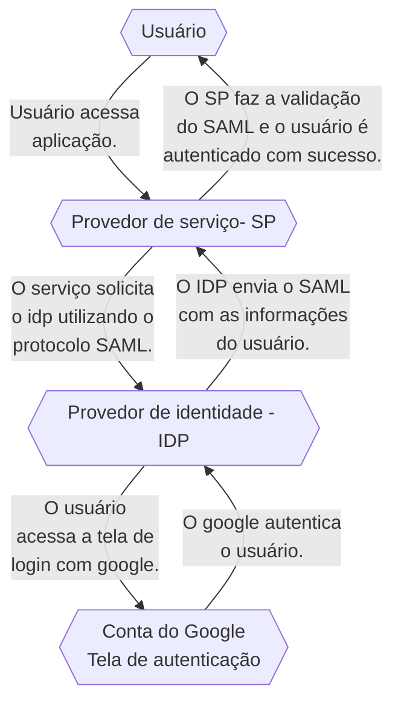

# GWAC
Documentação Técnica referente a certificação Professional Google Workspace Administrator.

Essa documentação visa ajudar a entender os principais tópicos e a se preparar para o conteúdo da prova de Professional Google Workspace Administrator.

  A maior parte da prova tem configurações de Gmail ou configurações no próprio painel de administrador do google. Os principais assuntos pra lembrar dessa parte da prova é sobre os protocolos de  como SPF, DMARC e DKIM, sobre regras de roteamento, as principais opções de compliance e outros assuntos que veremos nesse doc.

> [!NOTE]  
> As seções com "*" são as mais importantes dentro do contexto da prova.

<br>
<br>

<details>
<summary> Opções no Painel de Administrador </summary><br/>
  
## Opções no Painel de Administrador

Uma das coisas importantes pra prova é lembrar onde cada coisa pode ser encontrada dentro do painel de administrador como funções de usuários, de compliance, os principais relatórios, onde configurar cada coisa. A tabela abaixo mostra as principais opções dentro do painel de administrador:

 Opções do Painel de Administrador

| Opção no Painel de Administrador | Descrição                                        |
|:---------------------------------:|:--------------------------------------------------:|
| Users                           | Gerenciamento de usuários do sistema, incluindo adição, edição e exclusão de contas. |
| Domain                          | Configurações relacionadas aos domínios do sistema. |
| Billing                         | Gerenciamento de informações de faturamento e pagamentos. |
| Groups                          | Configuração de grupos com permissões específicas para usuários. |
| Apps                            | Configurações relacionadas a aplicativos conectados ou integrados ao sistema. |
| Devices                         | Gerenciamento de dispositivos associados ao sistema, se aplicável. |
| Account Settings                | Configurações gerais da conta do administrador. |
| Organization Units              | Configuração de unidades organizacionais para estruturar usuários ou recursos. |
| Security                        | Configurações relacionadas à  do sistema, como autenticação e permissões. |
| Reports                         | Relatórios e análises detalhadas sobre o desempenho e uso do sistema. |

Podemos seguir os seguintes caminhos para obter relatórios específicos, é importante lembrar que cada um desses relatórios entregam diferentes tipos de dados:

Principais caminhos do Painel

|Relatório|	Caminho|
|:-:|:-:|
|Relatórios Específicos |	Reports > Audit/Investigation > Events.|
|Roteamento de E-mail |	Apps > Google Workspace > Gmail > Routing.|
|Relatórios Gerais ( Em gráficos ) |	Reports > Reports > Apps Reports > Accounts.|
|Relatórios ( Em tabelas) |	Reports > Reports > Account reports > Accounts.|
|Compliance ( Gmail )	| Apps > Google Workspace > Gmail > Compliance.|

</details>

---

<details>
<summary> Funções administrativas </summary><br/>

  ##  Funções administrativas
  
Uma das boas práticas do google é a prática do privilégio mínimo onde cada usuário tem acesso às ferramentas e aos recursos necessários para as tarefas diárias. Para lidar com essa prática, podemos segmentar as funções administrativas dentro de uma empresa de modo que os colaboradores tenham acesso somente ao necessário.


Funções Administrativas Do GCP

|Função Administrativa |	Responsável Por |
|:-:|:-:|
|Superadministrador |	Gerencia todos os aspectos da Organização, incluindo recursos e privilégios. Recebe notificações importantes.|
|Administrador de Grupos |	Controla tarefas de Grupos do Google, gerencia perfis, cria e gerencia grupos, e adiciona marcadores de segurança.|
|Administrador de Gerenciamento de Usuários |	Realiza ações dos usuários, gerencia perfis e configurações de segurança.|
|Administrador de Atendimento ao Usuário |	Redefine senhas para usuários, visualiza perfis e estrutura organizacional.|
|Administrador de Serviços |	Gerencia dispositivos e configurações de serviços, ativa/desativa serviços e recursos.|
|Administrador de Dispositivo Móvel |	Gerencia dispositivos móveis, aplicativos e políticas de dispositivo.|
|Administrador de Armazenamento |	Gerencia o armazenamento, define limites, visualiza uso e acessa relatórios do Google Drive.|
|Administrador do Google Voice |	Gerencia configurações do Google Voice, números e licenças de usuário.|
|Administrador Revendedor e Administrador  Revendedor Indireto |	Funções exclusivas para revendedores autorizados do Google Workspace.|

</details>

---

<details>
<summary> Autenticação Google * </summary><br/>
  
## Autenticação Google
  
A autenticação do Google usa vários serviços, os principais conceitos vão de SSO a IDP e SP, vamos ver eles agora:

Serviços de autenticação do GCP

|Serviço|	Explicação|
|:-:|:-:|
|IDP ( Identity provider) |	Provedor de identidade que autentica usuários e emite tokens de segurança |
|SP ( Service  Provider ) |	Servidor que aceita tokens e da acesso aos usuários |
|SAML ( Security Assertion Markup Language ) |	Protocolo de autenticação, quando um usuário tenta acessar um app que usa SAML, o SP solicita o IDP para autenticar o usuário |
|SSO ( Single Sign on ) | Método de autenticação e autorização que permite que usuários acessem múltiplas aplicações com apenas um único login |

Diagrama de Como funciona a autenticação SSO



Etapas da autenticação com o google

1. O usuário acessa o serviço
1. O Serviço (SP) solicita o IDP com o protocolo SAML
1. A tela de autenticação com o google é aberta
1. O usuário é redirecionado com o SAML preenchido com suas informações
1. O Serviço(SP) Faz a validação do SAML
1. O Serviço garante acesso ao usuário
1. O usuário é autenticado com sucesso


### Autenticação OAUTH

A autenticação OAUTH 2.0 é um protocolo de autorização que permite que os aplicativos terceiros acessem recursos no workspace em nome do usuário. Sempre que você ver alguma questão em relação a autenticação de Apps terceiros, OAUTH pode ser uma solução utilizada


</details>

---


<details>
<summary> Google Cloud Directory Sync * </summary><br/>
  
## Google Cloud Directory Sync

O Google Cloud Directory Sync é o Serviço que permite sincronizar usuários, grupos e outros dados de um diretório do Active Directory (AD) da Microsoft (Outlook) com o Google Cloud Platform (GCP). Isso pode ser útil para empresas que desejam usar o GCP, mas que também precisam manter seus usuários e grupos em um diretório do AD.
 
> **O que é LDAP** -  O LDAP (Lightweight Directory Access Protocol) é um protocolo de acesso a diretórios frequentemente usado pelo Active Directory (AD), que é o serviço de diretório da Microsoft usado em ambientes Windows para gerenciar recursos, autenticação e políticas de .

O GCDS usa uma série de regras para decidir o que sincronizar porém algumas coisas não são sincronizadas. Veja na tabela abaixo o que pode ser sincronizado com GCDS (Google Cloud Directory Sync):

| O que pode ser sincronizado ✅ | O que não pode ser sincronizado ❌ |
|:------------------------------:|:---------------------------------:|
| Unidades Organizacionais (OUs) | Mensagens                         |
| Usuários               | Eventos                           |
| Perfis de usuários             | Arquivos                          |
| Grupos                         | Pastas                            |
| Esquemas organizacionais       | Senhas                            |
| Contatos                       |                                   |
| Recursos de calendário         |                                   |
| Licenças                       |                                   |


>  [!WARNING]
> Apesar do Directory Sync sicnronizar OUs e recursos do calendário não é recomendado Sincronizar eles.

### Etapas de como o GCDS funciona

1. O GCDS é instalado, configurado e recebe as autorizações necessárias;
2. Os dados são extraidos como uma lista do servidor AD;
3. o GCDS gera uma lista com todos os objetos que tem que ser sincronizados;
4. GCDS compara a lista e atualiza o domínio google.

> O GCDS não sincroniza senhas mas pode adicionar novas senhas. Outra opção é usar o serviço para sincronizar senhas, o GPS - google password sync.


</details>
</details>


---

<details>
<summary> DNS e Aliases * </summary><br/>

## DNS e Aliases

O DNS ou Domain Name System é o sistema de domínios responsável por armazenar e cuidar de todos os domínios e fazer a tradução de endereços para ip. O DNS possui diversos tipos de registos:


| Serviço                    | Explicação                                                                               |
|:----------------------------:|:-----------:|
| A Record                    | Registros DNS que mapeiam nomes de domínio para endereços IP IPv4.                        |
| MX Records                  | Registros DNS que especificam os servidores de e-mail para um domínio.                    |
| TXT Records     | Registros DNS usados para armazenar informações de texto sobre o domínio.               |
| CNAME Record                | Registros DNS usados para criar aliases (apelidos) para nomes de domínio.                |
| NS (Name Server) Records    | Registros DNS que especificam os servidores de nomes autoritativos para um domínio.     |
| SPF (Sender Policy Framework) Record | Registros DNS usados para verificar a autenticidade dos remetentes de e-mail.  |
| DKIM (DomainKeys Identified Mail) Record | Registros DNS que ajudam a autenticar e-mails enviados de um domínio.     |


>  [!IMPORTANT] 
> Para a prova de Professional Workspace Administrator é muito importante lembrar que os **TXT Records** armazenam qualquer tipo de texto para domínio enquanto os **Cname Records** armazenam somente os domínios.

### Cname x TXT Records

O txt record armazena textos, o Cname Mapeia Domínios.

| Use txt Records para:    | Use o Cname record para:        |
|--------------------------|----------------------------------|
| Autenticação de domínio.  | Criar apelidos de domínios.       |
| Configurar o SPF e o DMARC. | Migrar domínios para diferentes provedores. |
| Adicionar Restrições de acesso. | Testar o domínio.                |
| Verificação de integridade. |                                  |

Exemplo de txt record:
```
Nome: @ (representa o domínio raiz)
Tipo: TXT
Valor: "v=spf1 include:_spf.google.com ~all"
```
Exemplo de Cname Record:
```
Nome: blog
Tipo: CNAME
Valor: example.com
```

### Aliases

Aliases são Domínios secundários que apontam para o seu domínio princuipal, para adicionar um Alias, use o Directory API. O registro de Aliases é feito com um Cname Record

 Domínio teste : domain-name.test.google-a.com

 O da Calriz seria julio@calriz.test.google-a.com

</details>


---

<details>
<summary> Google Groups  </summary><br/>

## Google Groups 

Grupos são usados para agrupar usuários com base em critérios compartilhados, enquanto Unidades Organizacionais (OUs) criam uma estrutura hierárquica para organizar usuários e recursos em uma organização. Os grupos tem a função de decidir quais **recursos serão compartilhados com maior prioridade** que as OUs, por exemplo, grupos de OUs diferentes podem ter uma mesma permissão.


> [!NOTE]  
> Grupos podem ser utilizados para evitar a modificação de OUs.
  
<details>
<summary> Como criar grupos em uma organização </summary><br/>

Para criar um grupo em uma organização, você pode seguir estas etapas:

1. Acesse o [Console de administração do Google Workspace](https://admin.google.com).
2. Clique em "Diretórios".
3. Clique em "Grupos".
4. Clique em "Criar grupo".
5. Insira um nome para o grupo.
6. Selecione os usuários que deseja adicionar ao grupo.
7. Escolha as permissões que deseja conceder ao grupo.
8. Clique em "Criar".

  Para criar um grupo com todos de uma organização

 ```shell
everyone@dominio.com.br
```

</details>
</details>

---


<details>
<summary> Registros SPF, DKIM, DMARC E Bimi * </summary><br/>

## Registros SPF, DKIM, DMARC E Bimi

Serviços de e-mails

- Registros SPF - protege seu domínio de ser usado para enviar spam;
- assinatura DKIM - criptografia que protege o conteúdo de e-mail contra spoofim;
- Autenticação DMArc - gerencia mensagens verificar SPF e DKim;
- Bimi - Criação de marcas com dmarc.


| Serviço | Protocolo de   | Explicação       |
|:---------------------:|:---------------:|:--------------------------------------:|
| SPF (Sender Policy Framework) | Autenticação    | Protege e-mails contra spoofing e evita que os e-mails enviados sejam entregues como spam.     |
| DKIM (Domain Key Identified Mail) | Autenticação  | Assinatura digital. Ajuda a verificar se um determinado e-mail foi realmente enviado por um remetente autorizado.   |
| DMARC (Domain-based Message Authentication, Reporting, and Conformance) | Controle  | Protocolo de controle de e-mails enviados em seu nome, determinando como tratar os e-mails que não passaram nas verificações DKIM ou SPF. Ajuda a evitar a falsificação de e-mails. |
| BIMI (Brand Indicator for Message Identification)| - | Permite a exibição de logotipos de marcas em e-mails autenticados.    |
| Spoofing | -   | Refere-se à alteração de conteúdo dos e-mails. Para prevenir o spoofing, o Google oferece soluções como SPF, DMARC e DKIM.     |


Passos para autenticar e-mail para g-mails
1. garanta entrega e envite falsificações com SPF
2. Aumente a segurtança do e-mail enviado com DKIM
3. evite seu domínio de ser usado para enviar spam com DMARC
4. adicione a logo da sua marca com o BIMI

- O BIMI é um serviço que usa o VMC (Verified Mark Certificate) e um TXT record para criar marcas dentro do google. 

</details>

---

<details>
<summary> Roteamento de e-mail * </summary><br/>

## Roteamento de e-mail

Determina como os emails são roteados e armazenados:

| Métodos de Roteamento de E-mail | Descrição | Exemplo |
|----------------------------------|-----------|---------|
| Split Delivery                   | Envio de E-mail para dois sistemas distintos | GWSP > Outlook |
| Dual Delivery                    | Envio de E-mail para duas caixas do Gmail | Envio para duas contas |
| Catch-all                        | Envio de E-mails inválidos de uma organização | Quando alguém envia e-mail para um endereço inexistente |
| Redirect                         | Redirecionamento de e-mails para outras caixas | Conta inativada / Férias |


> Exemplo de uso
> Um funcionário foi demitido, para receber os e-mails enviados para ele, voce pode mapear a caixa de entrada com um map to map para receber os e-mails ( apps>gwsp>gmail>routing)

> Para splitar e-mails para servidor legado, é ncessário adicionar o servidor host e mudar a rota de envio para externa

</details>

---

<details>
<summary> Regras de Compliance </summary><br/>

## Regras de Compliance

As regras de Compliance são regras para lidar com os e-mails baseados em critérios como anexos, palavrões, linguagem, extenções,etc.. As regras de complicance escaneiam e-mails e podem bloquear caso a mensagem bata com alguma regra criada, as mensagens podem ser:

- Rejeitadas antes de chegar ao receptor;
- Enviada para quarentena para ser analisada por um administrador;
- Editada antes de ser enviada;
- Enviada como SPAM.


| Opção     | Permite que os usuários | Serve Para  |
|:---------------:|:------------:|:----------------------------------------:|
| Email And Chat Autodelete | Definam um período de tempo após o qual os e-mails e bate-papos serão automaticamente excluídos. | Proteger a privacidade dos usuários e a reduzir o risco de dados confidenciais serem expostos. |
| OCR for attachments   | Extraiam texto de anexos de e-mail e bate-papo. | Fins de conformidade, como auditorias ou investigações. |
| Restricted Delivery   | Restrinjam o envio de e-mail e bate-papo a certos destinatários ou domínios. | Proteger os usuários contra ataques de phishing ou spam. |
| Security Sandbox      | Enviem anexos de e-mail e bate-papo para uma sandbox de segurança antes de serem entregues ao destinatário. | Proteger os usuários contra malware e outras ameaças cibernéticas. |

> [!NOTE]  
> Security sandbox só está disponível para versões enterprise
security sandbox - ferramenta que abre o e-mail em espaço sandbox para detectar malwares em anexo de -emails.

> Comprehensive mail storage- Ferramenta que verifica se o e-mail foi enviado.

</details>

---

<details>
<summary> Migração de Serviços </summary><br/>

## Migração de Serviços

> [!WARNING]  
> Quando eu fiz a Prova de GWAC não caiu nenhuma questão envolvendo migração mas acho que é um assunto interessante de se saber.

### Fases de migração de deployment:

- Core it;
- Early adopters;
- Global go-live.


- Core it (adição de usuários)
  - Criação do design técnico;
  - Confirmação e testes do setup e identifique potencias problemas;
  - Identificar pontos de integração;
  - Familiarizar com ferramentas e tecnologias.

- Early Adopters (5 - 15% da força de trabalho)
  - Validar o plano de migração;
  - Obter feedbacks;
  - Testes de mudança de gerenciamento;
  - Adição e configuração de usuários, grupos e contatos.
  - nessa fase, o mx record envia primeiro para o servidor do google os e-mails e depois roteia para o servidor legado.

> [!NOTE]    
> Nessa fase é imporatante designar google guides para ajudar com a migração, eles podem ajudar os usuários a se adaptar melhor ao Google Workspace.


  
- Global go live (100% da força de trabalho) 
  - Inclusão de todos os funcionários;
  - Fácil acesso a treinamento requerido.
  
> [!NOTE]  
> O google possui o** Google workspace domain transfer** que é um serviço gerenciado para transferir domínios e o software **workspace migrate** para migrar o google workspace. Outra ferramenta importante nesse processo também é o Directory Sync.

### Migração de dados

Temos dois modos de migração para o Google

- Lado do Servidor (Server-Side Migration)
  - Migração do servidor de dados;
  - Mais controle e Report de erros;
  - Feito pelos técnicos de TI.
- Lado do Cliente (Client-Side Migration)
  - Usuários instalam e executam o software workspace migrate no computador local;
  - É aconselhavel treinar e dar suporte a esses usuários durante o processo.

#### Opções de migração de dados

Temos as seguintes opções de migração

- Nada é migrado:
  - Usuários só recebem o novo e-mail;
- Migração mínima:
  - O técnico define o que sera migrado para cada usuário; 
- Migração Completa:
  - Todos os dados são migrados, porém isso demora muito tempo.


Etapas de migração de dados

1. O técnica cria um arquivo CSV que contenha o endereço a ser migrado;
2. O serviço de migração é conectado ao servidor que dara os dados;
3. Os dados são adicionados aos novos usuários.

Relação da fase de migração e a migração de dados
- Core It - E-Mails parciais / Todos os contatos e calendários (Opcional);
- Early Adopters - Adição de dados dos usuários que participam dessa fase;
- Global Go Live - Migração Completa dos dados e recursos.

#### Coexistência

Durante um período, as organizações podem decidir por ter tanto o workspace e a plataforma legado, existem dois tipos de coexistência

- Existência de curto período ( - de 90 dias );
- Existência de longo período ( + de 90 dias ).

Para lidar com a coexistência, o google possui algumas ferramentas como por exemplo exibir o status ( Livre/Ocupado ) no e-mail. No geral, temos duas opções para lidar com o calendário
- Manter todos os recursos no calendário legado até a fase **Global Go Live**;
ou
- Mover os recursos na fase de **Early Adopters**.
</details>

---


<details>
<summary> Recebendo Updates  </summary><br/>

## Recebendo Updates

O google tem alguns lugares para salvar Updates. entre eles temos :

- Google workspace update blog - Todos up updates do google workspace;
- google workspace release calendar - Datas de todas as atualizações;

Ao configurar nossa organização para receber as atualizações, podemos escolher os seguintes métodos de update:

- Training or resource launcher - Mudanças mais tardias depois do período de teste
- Rapid release feature launch - Assim que lançar os usuários vão receber as alterações


</details>

---


<details>
<summary>  Ferramentas de Administrador  </summary><br/>

## Ferramentas de Administrador

### Google toolbox - ferramentas de administrador

| Serviços             | Explicação                                             |
|----------------------|-------------------------------------------------------|
| Google Toolbox       | Conjunto de ferramentas para gerenciar e proteger o Google Workspace. |
| Browser Toolbox      | Depurar e testar sites e aplicativos. (Problemas de conectividade)               |
| DNS Verification     | Verificar a configuração DNS da organização, testes como integridade e configurações.         |
| Encoding/Decoding    | Debugar problemas com codificações e decodificações. |
| Log Analyzer         | Análise de relatórios, de erros e avisos de ferramentas. |
| Mail                 | Análise do cabeçalho do e-mail para ver as rotas e protocolos envolvidos. |

> [!IMPORTANT] 
> A ferramenta que mais tem chance de cair na prova é a de Mail. Todo e-mail enviado tem as rotas e meios de autenticação definidos no Header do e-mail. Para ver os detalhes sobre ele, você pode procurar nos logs ou análisar a Head.


### Security investigation tool

Ferramenta de logs para analisar e tomar ações disponível somente na versão **Enterprise plus**.

- Podemos supender ou restaurar usuários;
- Acessar dados sobre dispositivos;
- Ver mensagens do gmail, deletar e-mails maliciosos e revisar atividade;
- Registros do drive;
- Identificar, triar e tomar ações de  e privacidade no seu domínio;
  
 Para usar, precisa das permissões (require reviewer e view email content);

</details>

---


<details>
<summary> Segurança </summary><br/>

  ## Segurança

Essa seção aborda alguns itens referente a Segurança no Painel de Administrador.
  
<details>
<summary> Google Vault </summary><br/>

Google Vault

Aplicativo para reter, manter, buscar e exportar dados. Tem várias questões na prova que falam sobre ele. No geral ele é utilizado para armazenar e auditar os dados do workspace. Com o Vault você pode abrir Holds (Casos) e gerenciar buscar para auditar os serviços que ele gerencia. 

> [!NOTE]  
> Mesmo os dados excluídos são ou arquivados o vault consegue acessá-los.
---

</details>

<details>
<summary> Verificação de Duas Etapas </summary><br/>

Para fazer a Verificação de Duas Etapas temos 3 opções:


| Método                    | Descrição                                       |
|---------------------------|-------------------------------------------------|
| Hardware Security Key      | Dispositivo físico para autenticação da conta. |
| Phone Built-in Security Key | Aplicativo de verificação de código em duas etapas. |
| Desafios de login | Desafios que podem ser usados para autenticação|

Na opção de Desafios de Login temos as seguintes opções:

| Desafio                    | Descrição                                                                                      |
|----------------------------|------------------------------------------------------------------------------------------------|
| Mobile devices login challenge | O Google envia um SMS para confirmar o código de verificação.                                |
| Employee ID login challenge   | Caso seja adicionado um ID de funcionário, os usuários podem utilizá-lo para verificar, mas é recomendado trocar o código periodicamente por questões de segurança. |
| Recovery email login challenge | O Google envia um e-mail para confirmar o código de verificação.                               |


Como ativar a verificação em duas etapas:

1. Segurança
2. 2- step verification
3. Allow 2SV
4. Save

---
   
</details>

<details>
<summary> Opções de segurança no Painel </summary><br/>

Opções de segurança dos usuários
- Restar senha
- Ver chaves de segurança
- Verificar verificação em duas etapas (2sv)
- Recuperar inforamções
- Requerer mudança de senha
- Desabilitar desafio de login
- Restar cookies de Sing-in
- ver e remover apps de terceiros

---

</details>

<details>
<summary> Checklist de Segurança </summary><br/>

Segue Abaixo um Checklist de Segurança para você saber se sua organização está segura essa lista foi retirada [desse site](https://support.google.com/a/answer/9211704?sjid=2171818016640872930-SA)

**Proteger suas contas**
  - [x] Usar senhas exclusivas
  - [x] Criar uma senha forte e uma conta mais segura
  - [x] Exigir comprovação de identidade para os administradores e usuários específicos
  - [x] Os administradores devem adicionar informações de recuperação à conta
  - [x] Criar uma conta de superadministrador adicional
  - [x] Manter as informações à mão para redefinir a senha de superadministrador
  - [x] Os superadministradores não devem permanecer conectados à conta
  - [x] Ativar a atualização automática de apps e navegadores da Internet
  - [ ] Ativar a verificação aprimorada de mensagem de pré-entrega
  - [ ] Ativar a verificação adicional de arquivos e links maliciosos para o Gmail
  - [ ] Evitar que os destinatários de e-mail marquem seu e-mail como spam
  - [ ] Autorizar remetentes de e-mail com o SPF
  - [ ] Restringir o compartilhamento de agendas com pessoas fora da sua empresa
  - [ ] Limitar quem pode ver os arquivos recém-criados
  - [ ] Avisar aos usuários quando eles compartilharem um arquivo com pessoas de fora da sua empresa


</details>
</details>

---


<details>
<summary> Algumas Notas úteis   </summary><br/>

## Algumas Notas úteis
  
- O Oauth é o protocolo de autorização que permite que aplicativos terceiros (third-party) acessem recursos em nome do usuário. Para dar permissões a apps terceiros, você precisa dos escopos de autorização e do client ID 

- O DLP (data loss protection) é um serviço para evitar o compartilhamento de informações sensíveis.

- Para adicionar arquivos CSV para usuários é obrigatório: primeiro nome, último nome, senha, e-mail e OU.

- Um usuário deletado só pode ter seus dados recuperados dentro de 20 dias. Para restaura-lo o seu nome não pode ter sido dado pra outra pessoa ou grupo.

- Content- aware access -Serviço que permite que somente dispositivos autenticados pela empresa possam logar no sistema.

- O google takeout é uma opção que impossíbilida que os dados sejam compartilhados fora de uma organização.

- Target audience - publico alvo - grupo de usuários para compartilhar itens, ajudam a melhorar  e facilitam o compartilamento adequado dentro de organizações. Para compartilhar arquivos no google temos duas opções mais recomendadas:

| Recurso         | Target Audience                                             | Visitor Sharing                                           |
|-----------------|-------------------------------------------------------------|-----------------------------------------------------------|
| Acesso          | Permite controlar quem pode acessar um recurso ou dado, com usuários pré-aprovados | Permite compartilhar dados com visitantes de um site ou aplicativo com qualquer pessoa que tiver o link. |
| Como Acessar    | Pode ser feito por meio de permissões de usuário, grupos ou papéis. O convite pode ser feito pela conta de e-mail | Os visitantes podem acessar os dados por meio de um link ou uma API. |
| Podem editar    | Depende das permissões concedidas.                          | Os visitantes não podem editar os dados, a menos que tenham permissões específicas. |
|Segurança   | Ajuda a proteger dados confidenciais de acesso não autorizado como usuários pré-aprovados. | Feito de forma segura usando um URL ou um código de compartilhamento criptografado. |


</details>

