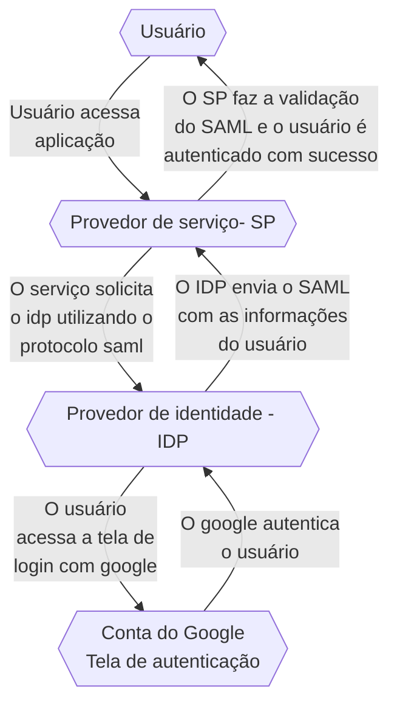

# GWAC
Documentação Técnica referente a certificação Professional Google Workspace Administrator.

Essa documentação visa ajudar a entender os principais tópicos e a se preparar para o conteúdo da prova de Professional Google Workspace Administrator.

  A maior parte da prova tem configurações de Gmail ou configurações no próprio painel de administrador do google. Os principais assuntos pra lembrar dessa parte da prova é sobre os protocolos de segurança como SPF, DMARC e DKIM, sobre regras de roteamento, as principais opções de compliance e outros assuntos que veremos nesse doc.


<details>
<summary> Opções no Painel de Administrador </summary><br/>
  
## Opções no Painel de Administrador

Uma das coisas importantes pra prova é lembrar onde cada coisa pode ser encontrada dentro do painel de administrador como funções de usuários, as funções de compliance, os principais relatórios, onde configurar cada coisa. A tabela abaixo mostra as principais opções dentro do painel de administrador:

 Opções do Painel de Administrador

| Opção no Painel de Administrador | Descrição                                        |
|:---------------------------------:|:--------------------------------------------------:|
| Users                           | Gerenciamento de usuários do sistema, incluindo adição, edição e exclusão de contas. |
| Domain                          | Configurações relacionadas aos domínios do sistema. |
| Billing                         | Gerenciamento de informações de faturamento e pagamentos. |
| Groups                          | Configuração de grupos com permissões específicas para usuários. |
| Apps                            | Configurações relacionadas a aplicativos conectados ou integrados ao sistema. |
| Devices                         | Gerenciamento de dispositivos associados ao sistema, se aplicável. |
| Account Settings                | Configurações gerais da conta do administrador. |
| Organization Units              | Configuração de unidades organizacionais para estruturar usuários ou recursos. |
| Security                        | Configurações relacionadas à segurança do sistema, como autenticação e permissões. |
| Reports                         | Relatórios e análises detalhadas sobre o desempenho e uso do sistema. |

Seguindo essa lógica, podemos seguir os seguintes caminhos para obter relatórios específicos, é importante lembrar que cada um desses relatórios entregam diferentes tipos de dados:


Principais caminhos do Painel

|Relatório|	Caminho|
|:-:|:-:|
|Relatórios Específicos |	Reports > Audit/Investigation > Events|
|Roteamento de E-mail |	Apps > Google Workspace > Gmail > Routing|
|Relatórios Gerais ( Em gráficos ) |	Reports > Reports > Apps Reports > Accounts|
|Relatórios ( Em tabelas) |	Reports > Reports > Account reports > Accounts|
|Compliance ( Gmail )	| Apps > Google Workspace > Gmail > Compliance|

</details>

---

<details>
<summary> Funções administrativas </summary><br/>

  ##  Funções administrativas
  
Uma das boas práticas do google é a prática do privilégio mínimo onde cada usuário tem acesso às ferramentas e aos recursos necessários para as tarefas diárias. Para lidar com essa prática, podemos segmentar as funções administrativas dentro de uma empresa de modo que os colaboradores tenham acesso somente ao necessário.


Funções Administrativas Do GCP

|Função Administrativa |	Responsável Por |
|:-:|:-:|
|Superadministrador |	Gerencia todos os aspectos da Organização, incluindo recursos e privilégios. Recebe notificações importantes.|
|Administrador de Grupos |	Controla tarefas de Grupos do Google, gerencia perfis, cria e gerencia grupos, e adiciona marcadores de segurança.|
|Administrador de Gerenciamento de Usuários |	Realiza ações dos usuários, gerencia perfis e configurações de segurança.|
|Administrador de Atendimento ao Usuário |	Redefine senhas para usuários, visualiza perfis e estrutura organizacional.|
|Administrador de Serviços |	Gerencia dispositivos e configurações de serviços, ativa/desativa serviços e recursos.|
|Administrador de Dispositivo Móvel |	Gerencia dispositivos móveis, aplicativos e políticas de dispositivo.|
|Administrador de Armazenamento |	Gerencia o armazenamento, define limites, visualiza uso e acessa relatórios do Google Drive.|
|Administrador do Google Voice |	Gerencia configurações do Google Voice, números e licenças de usuário.|
|Administrador Revendedor e Administrador  Revendedor Indireto |	Funções exclusivas para revendedores autorizados do Google Workspace.|

</details>

---

<details>
<summary> Autenticação Google </summary><br/>
  
## Autenticação Google
  
A autenticação do Google usa vários serviços, os principais conceitos vão de SSO a IDP e SP, vamos ver eles agora:

Serviços de autenticação do GCP

|Serviço|	Explicação|
|:-:|:-:|
|IDP ( Identity provider) |	Provedor de identidade que autentica usuários e emite tokens de segurança |
|SP ( Service  Provider ) |	Servidor que aceita tokens e da acesso aos usuários |
|SAML ( Security Assertion Markup Language ) |	Protocolo de autenticação, quando um usuário tenta acessar um app que usa SAML, o SP solicita o IDP para autenticar o usuário |
|SSO ( Single Sign on ) | Método de autenticação e autorização que permite que usuários acessem múltiplas aplicações com apenas um único login |

Diagrama de Como funciona a autenticação



Etapas da autenticação com o google

1. O usuário acessa o serviço
1. O Serviço (SP) solicita o IDP com o protocolo SAML
1. A tela de autenticação com o google é aberta
1. O usuário é redirecionado com o SAML preenchido com suas informações
1. O Serviço(SP) Faz a validação do SAML
1. O Serviço garante acesso ao usuário
1. O usuário é autenticado com sucesso

</details>

---


<details>
<summary> Google Cloud Directory Sync  </summary><br/>
  
## Google Cloud Directory Sync

O Google Cloud Directory Sync é o Serviço que permite sincronizar usuários, grupos e outros dados de um diretório do Active Directory (AD) da Microsoft com o Google Cloud Platform (GCP). Isso pode ser útil para empresas que desejam usar o GCP, mas que também precisam manter seus usuários e grupos em um diretório do AD.
 
> **O que é LDAP** -  O LDAP (Lightweight Directory Access Protocol) é um protocolo de acesso a diretórios frequentemente usado pelo Active Directory (AD), que é o serviço de diretório da Microsoft usado em ambientes Windows para gerenciar recursos, autenticação e políticas de segurança.

O GCDS usa uma série de regras para decidir o que sincronizar porém algumas coisas não são sincronizadas. Veja na tabela abaixo o que pode ser sincronizado com GCDS (Google Cloud Directory Sync).

| O que pode ser sincronizado ✅ | O que não pode ser sincronizado ❌ |
|:------------------------------:|:---------------------------------:|
| Unidades Organizacionais (OUs) | Mensagens                         |
| Usuários e Senhas              | Eventos                           |
| Perfis de usuários             | Arquivos                          |
| Grupos                         | Pastas                            |
| Esquemas organizacionais       | Senhas                            |
| Contatos                       |                                   |
| Recursos de calendário         |                                   |
| Licenças                       |                                   |


>  [!WARNING]
> Apesar do Directory Sync sicnronizar OUs e recursos do calendário não é recomendado Sincronizar eles.

### Etapas de como o GCDS funciona

1. O GCDS é instalado, configurado e recebe as autorizações necessárias
2. Os dados são extraidos como uma lista do servidor AD
3. o GCDS gera uma lista com todos os objetos que tem que ser sincronizados
4. GCDS compara a lista e atualiza o domínio google

> O GCDS não sincroniza senhas mas pode adicionar novas senhas. Outra opção é usar o serviço para sincronizar senhas, o GPS - google password sync.

</details>
</details>


---

<details>
<summary> DNS e Aliases </summary><br/>

## DNS e Aliases

O DNS ou Domain Name System é o sistema de domínios responsável por armazenar e cuidar de todos os domínios e fazer a tradução de endereços para ip. O DNS possui diversos tipos de registos:


| Serviço                    | Explicação                                                                               |
|----------------------------|------------------------------------------------------------------------------------------|
| A Record                    | Registros DNS que mapeiam nomes de domínio para endereços IP IPv4.                        |
| MX Records                  | Registros DNS que especificam os servidores de e-mail para um domínio.                    |
| TXT Records     | Registros DNS usados para armazenar informações de texto sobre o domínio.               |
| CNAME Record                | Registros DNS usados para criar aliases (apelidos) para nomes de domínio.                |
| NS (Name Server) Records    | Registros DNS que especificam os servidores de nomes autoritativos para um domínio.     |
| SPF (Sender Policy Framework) Record | Registros DNS usados para verificar a autenticidade dos remetentes de e-mail.  |
| DKIM (DomainKeys Identified Mail) Record | Registros DNS que ajudam a autenticar e-mails enviados de um domínio.     |


>  [!IMPORTANT] 
> Para a prova de Professional Workspace Administrator é muito importante lembrar que os **TXT Records** armazenam qualquer tipo de texto para domínio enquanto os **Cname Records** armazenam somente os domínios.

Cname x TXT Records

O txt record armazena textos, o Cname Mapeia Domínios.

| Use txt Records para:    | Use o Cname record para:        |
|--------------------------|----------------------------------|
| Autenticação de domínio  | Criar apelidos de domínios       |
| Configurar o SPF e o DMARC | Migrar domínios para diferentes provedores |
| Adicionar Restrições de acesso | Testar o domínio                |
| Verificação de integridade |                                  |

Exemplo de txt record
```
Nome: @ (representa o domínio raiz)
Tipo: TXT
Valor: "v=spf1 include:_spf.google.com ~all"
```
Exemplo de Cname Record
```
Nome: blog
Tipo: CNAME
Valor: example.com
```


pop - sincronização do gmail e outros serviços de email
Imap - sincroniza a conta em vários dispositivos


### Aliases

Aliases são Domínios secundários que apontam para o seu domínio princuipal, para adicionar um Alias, use o Directory API. O registro de Aliases é feito com um Cname Record


> Domínio teste : domain-name.test.google-a.com

> O da colab seria julio.ferrer@colaborativaeduc.test.google-a.com

</details>


---

<details>
<summary> Google Groups  </summary><br/>

## Google Groups 

Grupos são usados para agrupar usuários com base em critérios compartilhados, enquanto Unidades Organizacionais (OUs) criam uma estrutura hierárquica para organizar usuários e recursos em uma organização. Os grupos tem a função de decidir quais **recursos serão compartilhados com maior prioridade** que as OUs, por exemplo, grupos de OUs diferentes podem ter uma mesma permissão.


> Grupos podem ser utilizados para evitar a modificação de OUs.
  
<details>
<summary> Como criar grupos em uma organização </summary><br/>

Para criar um grupo em uma organização, você pode seguir estas etapas:

1. Acesse o [Console de administração do Google Workspace](https://admin.google.com).
2. Clique em "Diretórios".
3. Clique em "Grupos".
4. Clique em "Criar grupo".
5. Insira um nome para o grupo.
6. Selecione os usuários que deseja adicionar ao grupo.
7. Escolha as permissões que deseja conceder ao grupo.
8. Clique em "Criar".

  Para criar um grupo com todos de uma organização

 ```shell
everyone@dominio.com.br
```

> tipos de acesso de grupos - public, team e restricted 

</details>
</details>

---


<details>
<summary> Google Vault </summary><br/>

Aplicativo para reter, manter, buscar e exportar dados. Tem várias questões na prova que falam sobre ele. No geral ele é utilizado para armazenar e auditar os dados do workspace.


</details>

---

<details>
<summary> Registros de segurança (SPF,DKIM,DMARC) </summary><br/>

serviços de e-mails
Registros SPF - protege seu domínio de ser usado p enviar spam
assinatura DLOM - criptografia que protegej o conteúdo de e-mail
Autenticação DMArc - gerencia mensagens verificar SPF e DKim
Bimi - Criação de marcas com dmarc

passos para autenticar e-mail para g-mails
1. garanta entrega e envite falsificações com SPF
2. Aumente a segurtança do e-mail enviado com DKIM
3. evite seu domínio de ser usado para enviar spam com dmarc
4. adicione a logo da sua marca com o BIMi


Opções de segurança de Gmail

SPF - Sender Policy framework - Estrutura da política do remetente -  mecanismo de autenticação de e-mail que ajuda a evitar o spam e a falsificação de e-mail.
Dkim - Domain Keys Identified Mail Standard - Prevenção de Spoofing adicionando um header personalizado ao e-mail.
DMarc - Domain based message authentication - fala pro e-mail como lidar com mensagens SPF/DKIM

> email spoofing - conteúdo alterado por falta de configuração


> Bimi - brand indications for message indentification, serve para adicionar uma logo da sua marca


</details>

---

<details>
<summary> Roteamento de e-mail </summary><br/>


Mail routing

Determine como os emails são roteados e armazenados

| Tipo de roteamento | Definição                                                                                                          |
|--------------------|--------------------------------------------------------------------------------------------------------------------|
| Direct delivery    | O e-mail é entregue diretamente ao servidor de e-mail do destinatário.                                            |
| Dual delivery      | O e-mail é entregue ao servidor de e-mail do destinatário e a um serviço de entrega alternativo, como uma caixa de entrada de spam ou um serviço de arquivamento. |
| Split delivery     |Envio de e-mails para vários sistemas . |
| catch all | redirecionamento de e-mails invalidos |
| Redirecionamento | redireciona os e-mails para outra caixa de entrada |

> para evitar dados deletados e empregados demitidos, de pra eles uma lience de archived user (Archived user) e extenda o tempo da caixa de entrada

> um funcionário foi demitido, para receber os e-mails enviados para ele, voce pode mapear a caixa de entrada com um map to map para receber os e-mails ( apps>gwsp>gmail>routing)


> Para splitar e-mails para servidor legado, é ncessário adicionar o servidor host e mudar a rota de envio para externa

</details>

<details>
<summary> Segurança </summary><br/>


Ativar verificação em duas etapas
1. Segurança
2. 2- step verification
3. Allow 2SV
4. Save

Forçar senhas fortes
1. Segurança
2. password management
3. Config
4. Save

Bloquear apps não seguros
1. Securit
2. Less secure apps
3. Disable less secure apps
4; save

Opções de segurança dos usuários
- Restar senha
- Ver chaves de segurança
- Verificar verificação em duas etapas (2sv)
- Recuperar inforamções
- Requerer mudança de senha
- Desabilitar desafio de login
- Restar cookies de Sing-in
- ver e remover apps de terceiros 

</details>


<details>
<summary> Regras de Compliance </summary><br/>


Compliance

Regras de complicance escaneiam e-mails e podem bloquear caso a mensagem bata com alguma regra criada, as mensagens podem ser:
- Rejeitadas antes de chegar ao receptor
- Enviada para quarentena para ser analisada por um administrador
- Editada antes de ser enviada
- Enviada como SPAM

Opções de compliance
- Emails e chat auto-deletion
- OCR for e-mail attachments
- Restricted delivery
- security sandbox

| Serviço                   | Uso                                                                                     |
|---------------------------|-----------------------------------------------------------------------------------------|
| Emails e chat auto-deletion | Os usuários podem definir um intervalo de tempo após o qual os e-mails e as mensagens de bate-papo serão excluídos automaticamente. Isso pode ajudar a proteger a privacidade dos usuários e a evitar o armazenamento de informações confidenciais por muito tempo. |
| OCR for e-mail attachments | Os usuários podem usar a tecnologia OCR para converter anexos de e-mail em texto. Isso pode ser útil para visualizar anexos que não são suportados por um programa de e-mail ou para extrair informações de anexos que não são formatados em um formato legível por humanos. |
| Restricted delivery       | Os usuários podem restringir a entrega de e-mails a certos endereços de e-mail ou domínios. Isso pode ser útil para evitar que e-mails sejam entregues a pessoas ou organizações indesejadas. |
| Security sandbox          | Os usuários podem usar uma sandbox de segurança para executar arquivos e aplicativos em um ambiente isolado. Isso pode ajudar a proteger os usuários contra malware e outros ataques. |

> Security sandbox só está disponível para versões enterprise
security sandbox - ferramenta que abre o e-mail em espaço sandbox para detectar malwares em anexo de -emails.

> Comprehensive mail storage- verifica se o e-mail foi enviado

</details>

<details>
<summary> Migração de Serviços </summary><br/>

fases de migração de deployment

- Core it
- Early adopters
- Global go-live


### Core it (adição de usuários)
- Criação do design técnico
- Confirmação e testes do setup
- Identificar pontos de integração
- Familiarizar com ferramentas e tecnologias

### Early Adopters (5 - 15% da força de trabalho)
- Validar a migração
- Obter feedbacks
- Testes de mudança de gerenciamento
- Adição e configuração de usuários, grupos e contatos
> Designe google guides para ajudar com a organização

- nessa fase, o mx record envia primeiro para o servidor do google os e-mails e depois roteia para o servidor legado
  
### Global go live (100% da força de trabalho) 
- Inclusão de todos os funcionários
- Fácil acesso a treinamento requerido


> Para migrar um serviço Imap, use a ferramente data migration

</details>


<details>
<summary> Recebendo Updates  </summary><br/>


> Google workspace update blog - todos up updates do google workspace

> google workspace release calendar - datas de todas as atualizações

> existem dois tipos de atualizações

> training or resource launcher - mudanças mais tardias

> rapid release feature launch - assim que lançar os usuários vão receber as alterações


</details>


<details>
<summary> Algumas Notas úteis   </summary><br/>

  
> O Oauth é o protocolo de autorização que permite que aplicativos terceiros (third-party) acessem recursos em nome do usuário

> Para dar permissões a apps terceiros, você precisa dos escopos de autorização e do client ID 

> O dlp (data loss protection) é um serviço para efvitar o compartilhamento de informações esnsíveis

> Para adicionar arquivos CSV para usuários é obrigatório: primeiro nome, último nome, senha, e-mail e OU

> Um usuário deletado só pode ter seus dados recuperados dentro de 20 dias.

> para restaura-lo o seu nome não pode ter sido dado pra outra pessoa ou grupo

> Content-aware - somente dispositivos da empresa podem logar no sistema


Target audience - publico alvo - grupo de usuários para compartilhar itens, ajudam a melhorar se gurança e facilitam o compartilamento adequado 
Content- aware access - para usuários conectarem de casa em computador pessoais, configure o endpoint verification


</details>


<details>
<summary>  Ferramentas de Administrador  </summary><br/>


> admin toolbox - ferramentas de administrador

google toolbox 
browser toolbox - problemas de conectividade
dns verification - testes como integridade e configurações
enconding/decodign - debugar problemas com codificações
log analyzer - erros e avisos em arquivos e ferramentas
mail - análise do cabeçalho do e-mail para ver entrega e roteamento 

O header do e-mail é usado para definir as rotas e meios de autenticação

> para ver se um e-mail foi enviado, verifique o log dele


Security investigation tool

Ferramenta de logs para analisar e tomar ações

> podemos suspoender ou restaurar usuários
> Para usar, precisa das permissões (require reviewer e view email content)
> só pra liçença bussiness plus pra cima
> Serve para deletar e-mails maliciosos e revisar atividade
> Identificar, triar e tomar ações de segurança e privacidade no seu domínio


<details>
<summary> </summary><br/>
</details>


